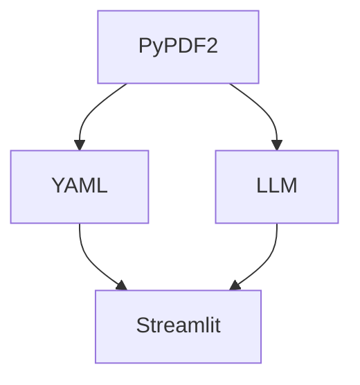

# Resume-Analyzer

> Resume analyzer application is a tool designed to review and evaluate resumes submitted by job applicants.

## How to use this application
     1.Click on the "Open in Streamlit" button located above.
     2.Navigate to the main page and upload your resume in PDF format.
     3.Please wait for a few minutes as the processing may take some time.
     4.In case you come across any errors such as parser or scanner issues, just restart the application and wait for a moment.
     5.Once your resume has been successfully extracted, you can review the summarized content.
     6.Scroll down to see the suggested skills and experience.
     7.Next, access the navigation menu and select the "Job Recommendations" page.
     8.Search for job opportunities based on your skills and preferred locations.
     
 ## Features :
- [x] __Resume Parsing__ : The application should be able to extract information from resumes, including personal details, contact information, education, work experience, skills, and certifications. 
  
- [x] __Keyword Matching__ : The application can match keywords and key phrases in the resume against a predefined list of skills and qualifications relevant to the job posting. It helps identify if the applicant possesses the required skills.

- [x]  __Format Analysis__ : It assesses the formatting and layout of the resume, checking for consistency, readability, and adherence to standard resume guidelines. For example, it may check for proper use of headings, bullet points, and fonts.
  
- [x]  __Job recommendation system__ : That provide personalized job suggestions based on a candidate's skills and qualifications can be valuable tools for both job seekers and employers. 

## Tools and libraries used for this project :

| Tool/Lib | Purpose |
| --- | --- |
| Python |Python serves as the core programming language for the entire project. It's used to write the application's logic, manage data, and handle various tasks, such as parsing resumes, analyzing content, and generating reports. |
| LLM (Large Language Model) | Large language models like GPT-3 can be used for natural language understanding and text analysis. In a resume analyzer application, you might use LLMs to extract key information from resumes, identify skills and qualifications, and even generate feedback or recommendations for job seekers. |
| YAML (YAML Ain't Markup Language) | YAML files can be employed to store configuration settings, rules, and templates for the resume analysis process. For example, you can define keywords, skills, and formatting guidelines in YAML files that the application uses to assess resumes. |
| Streamlit | Streamlit simplifies the creation of the user interface for the resume analyzer. You can build a web-based front end where users can upload their resumes, view analysis results, and receive recommendations. |
| Selenium | Selenium can be used to automate interactions with job posting websites or portals. It can navigate web pages, submit forms, and retrieve resumes uploaded by job applicants.  |
| PyPDF2| PyPDF2 plays a crucial role in handling PDF resumes. It can be used to extract text, extract metadata, and even convert PDF content to a format that can be easily analyzed by your application. |

## Approach :

## User Interface 
__Home Page__

> Upload a resume file to extract

__Skills and Suggestions__

> Scrolldown to know your skills and suggested skills to improve

__Strengths and Areas for improvement__

> Note required skills to enhance 

__Current Job Recommendations through LinkedIn__

> Search jobs with your skills and preferred location

__Jobs distribution by Cities__

> Location-wise available jobs

